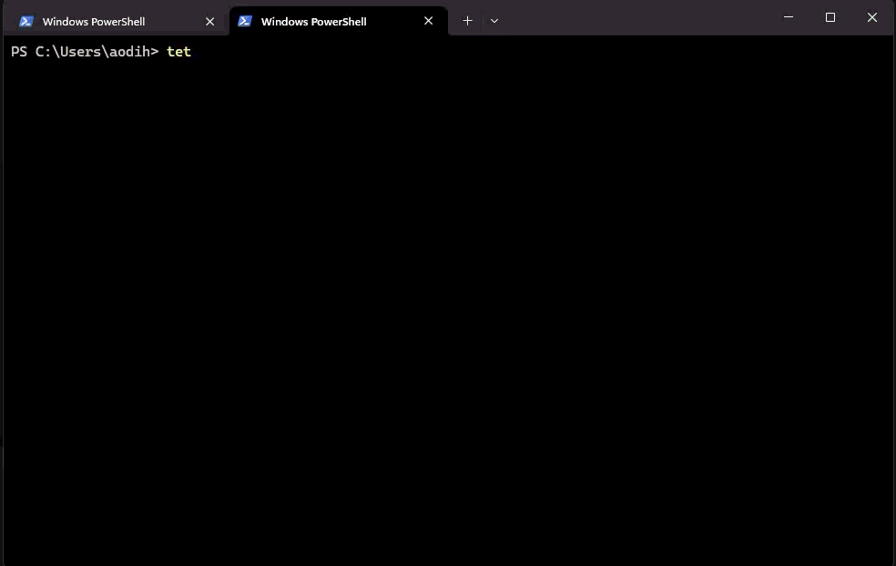

# tet

A simple CLI command snippet manager. Save long commands with short names and run them instantly.



## Install

**Linux / macOS** *(not yet tested — use from source if you run into issues)*:
```sh
curl -fsSL https://raw.githubusercontent.com/aodihis/tet/main/scripts/install.sh | sh
```

**Windows (PowerShell):**
```powershell
irm https://raw.githubusercontent.com/aodihis/tet/main/scripts/install.ps1 | iex
```

The scripts download the latest pre-built binary from [GitHub Releases](https://github.com/aodihis/tet/releases) and place it in `~/.local/bin` (Linux/Mac) or `%USERPROFILE%\.local\bin` (Windows).

**From source (requires Rust):**
```sh
cargo install --git https://github.com/aodihis/tet
```

## Update

Re-run the same install command to get the latest version:

**Linux / macOS** *(not yet tested)*:
```sh
curl -fsSL https://raw.githubusercontent.com/aodihis/tet/main/scripts/install.sh | sh
```

**Windows (PowerShell):**
```powershell
irm https://raw.githubusercontent.com/aodihis/tet/main/scripts/install.ps1 | iex
```

**From source:**
```sh
cargo install --git https://github.com/aodihis/tet --force
```

## Usage

### Save a snippet

Interactive (opens TUI form):
```
tet save
```

Non-interactive:
```
tet save <name> <command...>
tet save -g <group> <name> <command...>
```

Examples:
```
tet save ping "ping 8.8.8.8 -n 4"
tet save -g home dns "nslookup google.com 8.8.8.8"
```

### Run a snippet

```
tet <name>
tet <group> <name>
```


### List snippets

```
tet list
```

The list opens a TUI with a live search bar. Type to filter by name, group, or command content. Press Enter on a snippet to run it.

### Delete a snippet

```
tet delete <name>
tet delete -g <group> <name>
```

Aliases: `tet del`, `tet rm`

### Save last shell command

```
tet save-last
```

Opens the save form with the previous command pre-filled.

**Windows (PowerShell):** works out of the box — reads your PowerShell history automatically. No setup needed.

**bash / zsh:** requires a one-time shell hook install so `tet` knows what your last command was:

```bash
tet shell bash >> ~/.bashrc   # bash
tet shell zsh  >> ~/.zshrc    # zsh
```

Restart your shell after installing. The hook runs silently in the background and writes your last command to a temp file before each prompt.

## Data storage

Snippets are stored in SQLite at:
- **Windows:** `%APPDATA%\tet\tet.db`
- **Linux/Mac:** `~/.local/share/tet/tet.db`

## Reserved words

These cannot be used as snippet names:
`save`, `save-last`, `list`, `ls`, `search`, `find`, `delete`, `del`, `rm`, `help`, `run`, `shell`, `-`
